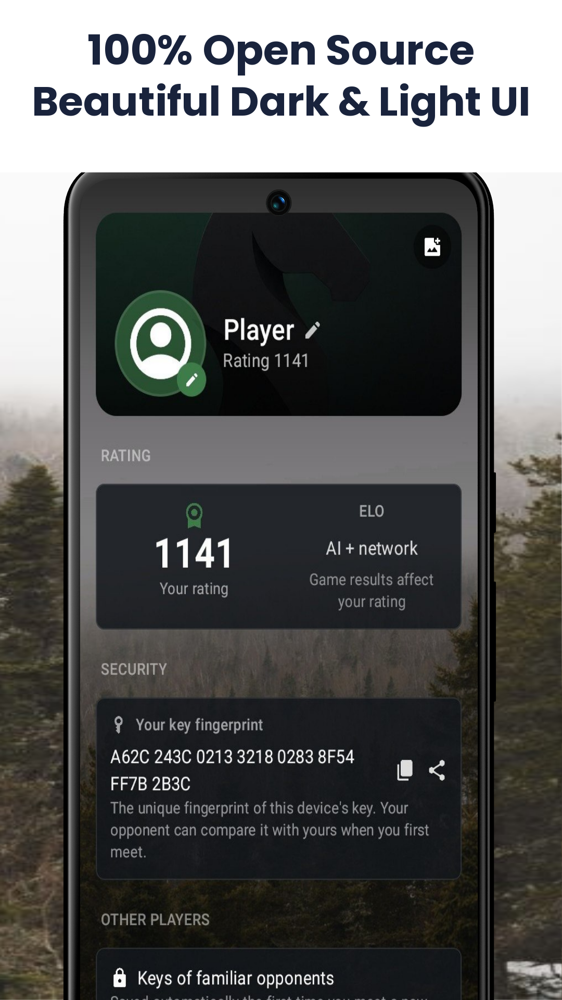
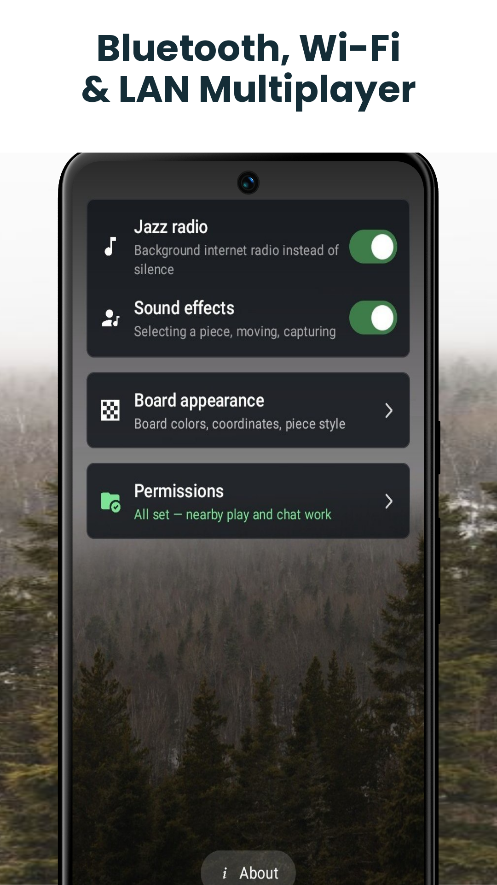

<p align="center">
  
</p>

<h1 align="center">Matewawe</h1>

<p align="center">
  <a href="releases/Matewawe-v1.0.37.apk"></a>
</p>

Android APK builds for **Matewawe**, organized as sequential, incrementally versioned releases (`v1.0.0` → `v1.0.37`).

> **Note:** `v1.0.32`–`v1.0.36` have no recoverable build timestamp (reproducible Android builds normalize internal file dates); they are ordered right before `v1.0.37`, the file explicitly named `Matewawe.apk` — the current, official latest build.

## Screenshots

<p align="center">
  
  
  
  
</p>

## Installation


1. Download the APK for the version you want from [`releases/`](releases/).
2. On your Android device, allow installs from unknown sources for the app you use to open the file (Settings → Apps → Special access → Install unknown apps).
3. Open the downloaded `.apk` file and confirm the install.

Or via `adb`:

```sh
adb install releases/Matewawe-v1.0.37.apk
```

## Verifying a download


Compare the SHA-256 checksum against the value listed in [CHANGELOG.md](CHANGELOG.md):

```sh
sha256sum releases/Matewawe-v1.0.37.apk
```

## Repository structure


```
.
├── releases/           # Versioned APK builds (Matewawe-vX.Y.Z.apk)
├── assets/              # Icon and README images
│   └── screenshots/     # App screenshots
├── CHANGELOG.md         # Per-version build dates, sizes and checksums
└── README.md
```

## Versioning

Builds are numbered sequentially by build date where known. `v1.0.37` (`Matewawe.apk`) is the latest official build.
