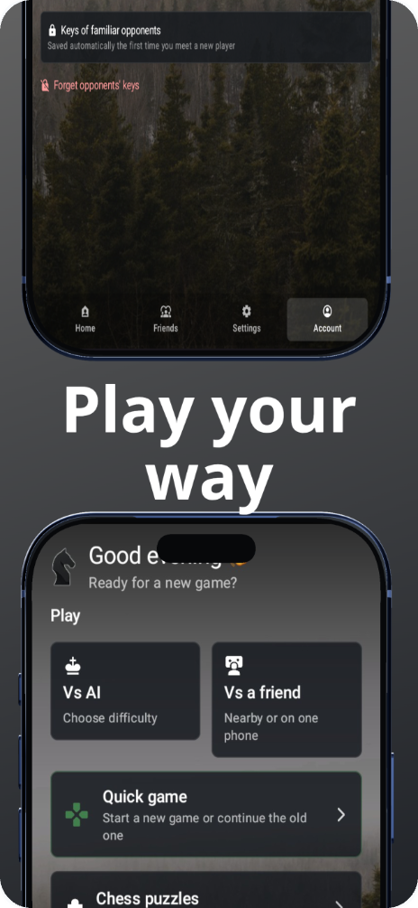
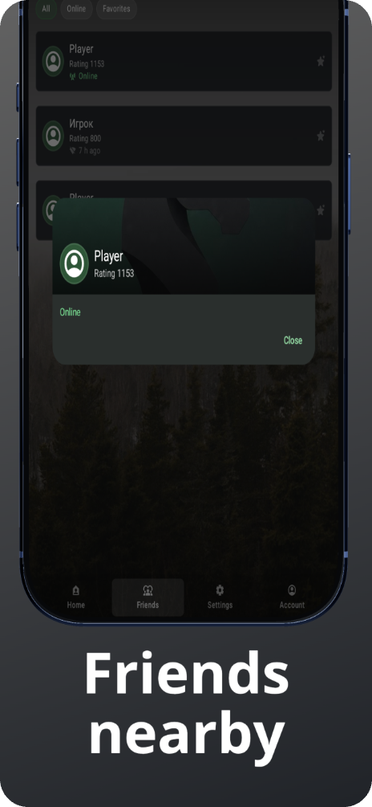

<p align="center">
  
</p>

<h1 align="center">Matewawe </h1>

<p align="center">
  <a href="releases/Matewawe-v1.0.41.apk"></a>
</p>


**A beautiful, open-source chess app for Android.**

Play chess against AI, solve chess puzzles, learn and practice
chess openings, or play local multiplayer games with friends
over Bluetooth and Wi-Fi/LAN.

<p align="center">
  
</p>

## Features

- 🤖 AI opponent with adjustable difficulty
- 🧩 Chess puzzles and tactical training
- 📖 Chess openings — learn and practice opening lines
- ♟️ Opening practice for different variations and move sequences
- 📶 Local multiplayer over Bluetooth/LAN
- 👥 Nearby player discovery over local Wi-Fi
- 🌙 Dark theme
- 🌍 English, Russian, German, Japanese, Lithuanian and Chinese
- 🔓 100% open source


## Screenshots

<p align="center">
  
  
  
  
  
</p>

## Installation


1. Download the APK for the version you want from [`releases/`](releases/).
2. On your Android device, allow installs from unknown sources for the app you use to open the file (Settings → Apps → Special access → Install unknown apps).
3. Open the downloaded `.apk` file and confirm the install.

Or via `adb`:

```sh
adb install releases/Matewawe-v1.0.41.apk
```

## Verifying a download


Compare the SHA-256 checksum against the value listed in [CHANGELOG.md](CHANGELOG.md):

```sh
sha256sum releases/Matewawe-v1.0.41.apk
```

## Repository structure


```
.
├── releases/           # Versioned APK builds (Matewawe-vX.Y.Z.apk)
├── assets/              # Icon and README images
│   └── screenshots/     # App screenshots
├── CHANGELOG.md         # Per-version build dates, sizes and checksums
├── LICENSE              # GNU GPLv3
└── README.md
```

## License

This project is licensed under the **GNU General Public License v3.0** — see the [LICENSE](LICENSE) file for details.
